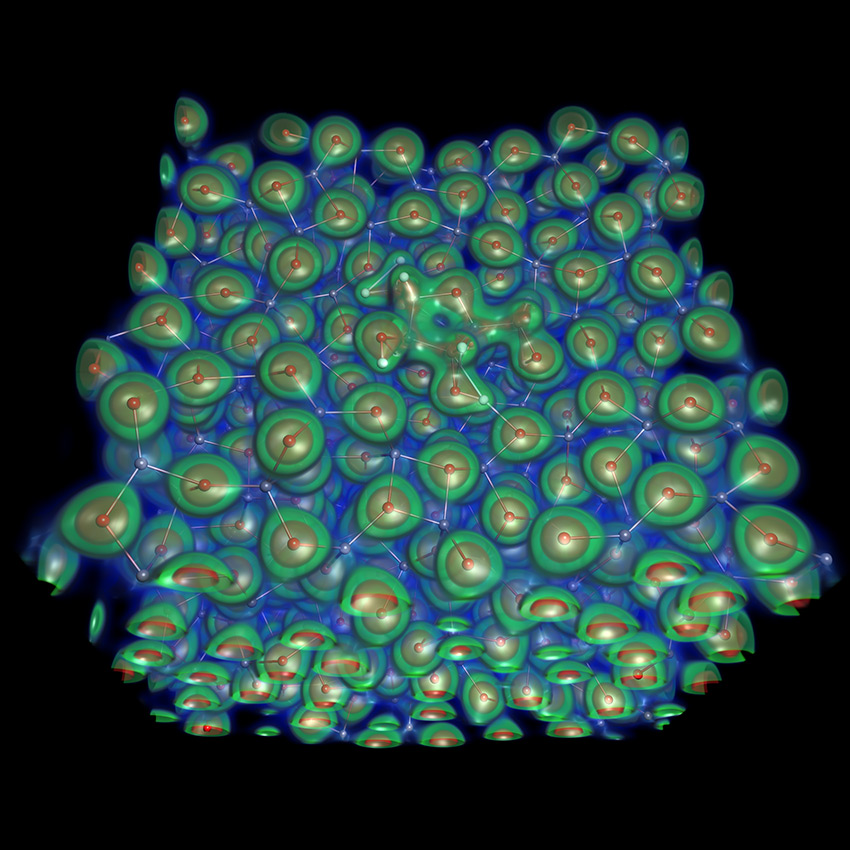
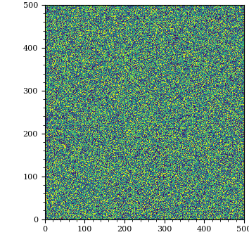
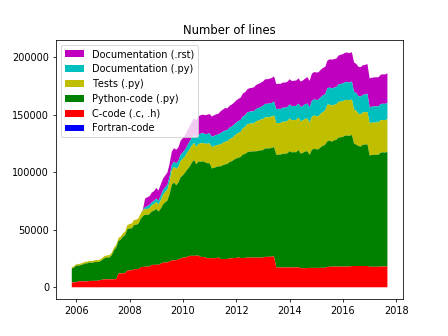

# Design choices {.section}

# PlasmaBox

* Kinetic plasma simulation code
    - particle-in-Cell with computational particles and electromagnetic fields are in grid
* Hybrid C++14/Python code 
    - domain super-decomposition with MPI 
    - massively parallel with runs on >10k cores

{.center width=100%}

# GPAW

* Density-functional theory -based electronic structure
* Python + C + libraries (numpy, BLAS, LAPACK)
    - various parallelization levels with MPI
    - over 10k cores with some modes
    - ~20 developers all around world

{.center width=50%}

{.center width=50%}

# Why develop software? 

* To do science
* To create a product

* Supercomputing platforms enable investigating bigger and more complex problems

* **Do science**
    - scientific articles
    - method-oriented articles presenting code and methods

* **Code as a product**
    - prestige and fame
    - gateway into projects, collaborations
    - citations, co-authorships
    - work on the bleeding edge

# PlasmaBox: Going big...

* Kinetic plasma simulations are microscopical (<1cm)
    - bigger simulation domains mean more realistic, larger systems
* Recently simulated turbulent plasma with 10^10 particles 
    - new physics starts to appear at larger scale

{.center width=80%}

# Starting position
* New code or existing project / rewrite of old code?

* **Questions**: your software project?

# PlasmaBox & GPAW

* PlasmaBox
    - new code 
    - +1yr of development
    - allowed to start from scratch and use new technologies

* GPAW
    - existing code with basic features mostly working (95 %) in 2005
    - choice of physical model and  programming languages had been made
    - production ready in 2008-2009
        - science done already earlier

# Design model

* Development is not only about physics and numerics
    - also about **how** you do it
* Instead of "Just code" it is advantageous to plan a little too!
* So-called Agile Development
    - umbrella term for different software development methods
    - divide work into small tasks, define short working period, review, repeat

# Agile development model

* Focused on iterative and incremental development
    - quick prototyping
    - supports continuous publication
    - analysis, coding, testing, etc. never end

* Development cycle
    - plan
    - design
    - develop
    - test
    - release
    - feedback

# Parallelization strategies

* Planning includes thinking what is the target platform
* Target machines: laptops, small clusters, supercomputers
    - openMP, MPI, MPI+OpenMP, GPUs
- From shared memory to distributed memory machines
    - keep in mind that most machines are distributed memory systems = MPI
- Moving from <1000 cores to >10k cores
    - parallellization strategies need to be considered
    - non-blocking, avoiding global calls,...
- Accelerators
    - GPUs have their own tricks and quirks

# PlasmaBox: Parallellization

* PlasmaBox has uses a new novel parallellization strategy
    - relies on dividing work among small subregions of the grid
    - computational grid (i.e., what rank owns which tiles) is constantly changing to balance the load
* Moving beyond 1000 cores is non-trivial
    - non-blocking communication
    - removal of collectives
    - re-design of IO

{.center width=80%}

# Programming languages
* Selection of languages
    - most common are C, C++, Fortran
    - mostly matter of taste
- C++ more object-oriented features and many more data structures (maps, lists, etc.); low-level memory management
- Fortran is really for number crunching, good array syntax
- But also newcomers like Python/Julia
    - faster coding cycle and less error prone
    - testing, debugging, and prototyping much easier

# Hybrid codes 
- Different languages can be interfaced together
    - best of both worlds
- low level languages (C, C++, Fortran) for costly functions
- high-level languages (Python, Julia, R) for main functions
- Combinations/suggestions
    - Python & C++ (PyBind11) for object-oriented programming
    - Julia & Fortran (native) for functional programming

# PlasmaBox: C++14/Python3 code

* PlasmaBox is an example of a hybrid code
* Low-level "kernels" are in C++
* High-level functionality is operated from Python scripts
* So far it has been an excellent choice
    - fast code
    - ease of use
    - rapid prototyping

# Modular code design: programming
* Good code is modular
    - encapsulation 
    - self-contained functions
    - no global variables, input what you need
* Modular code takes more time to design but is **lot** easier to extend and understand

# Modular code design: tools

- avoid not invented here syndrome
- leverage existing software and libraries
    - libraries
        - numerical (BLAS, solvers,...)
        - I/O
        - parallelization
    - frameworks?
        - plug your model into an existing framework?
        - Petsc, Trilinos, BoxLib++, Charm++, ArmReX, corgi,...

- caveats:
    - is the lib still supported/updated?
    - do you trust the source, is it widely used
    - is there documentation
    - does it support all the features

# Modular code design: development tools
- Software development is time consuming, many tools exists to help you in the process
- Build systems automate compiling
    - Makefiles, CMake, Ninja, ...
- Debuggers
    - lots of tools for finding bugs
- Compilers
    - compilers are not the same, compiler bugs are real!
    - test your code with different compilers (gnu, clang, intel, cray,...)

- **Questions**: Choices in your software and experiences about them?

# GPAW: Modular design
- Object oriented features and Python modules heavily utilized
- Main numerical kernels well separated from high level algorithms
- New features can be developed independently
{width=40%}

# Data formats

- Data has to be "designed" too
- Data formats
    - not just plain text files/binary files
    - platform-independent formats (HDF5, NetCDF, ...)
    - metadata together with the data?
- log files
    - especially with HPC applications some kind of log file system is useful
- standard formats
    - your field might have some data standards (e.g., PML for plasma codes)
- Remember also that large simulations produce lots of data
    - storing "big data" is an issue

# PlasmaBox: IO issues

- PlasmaBox uses rank-independent multiple-file IO strategy
    - excellent performance as there is no synching
    - but, sometimes the burst performance is too good...
        - 10k cores writing ~TBs of data in seconds is nice for the user but file system might not like it

# Open vs closed source

- And what about code availability?
- Open source
    - right thing to do
    - opens collaborations
    - easier outside help
    - funding agencies support this

- negative:
    - loose some control?
    - do you loose investment?

- **Question**: What do you think?

# Summary 
- Software design is all about planning (agile development)
- productivity
    - modular design
    - use existing libraries
    - use & adopt design, community, and collaboration tools
    - programming language and design selection

