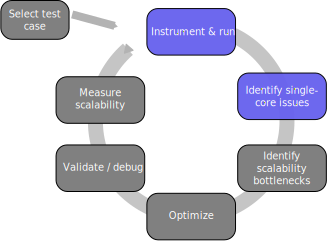

# GPU performance optimization {.section}

# Doesn't the compiler do everything?
- GPUs are ubquituos in HPC
- GPUs are powerful and complex
- parallelism has to be explicitely expressed by the programmer

# General consideration
- Keep all the compute resources busy (idle resources are a waste)
- Minimize the synchronization at all levels
- Minimize the data transfers between host and device
- Keep the data in faster memory and use an appropriate access pattern

# Compute bound vs memory bound

- **Compute Bound:** The program spends most of its time performing calculations.
  - GPU cores fully occupied with calculations.
  - Complex mathematical operations, simulations, or algorithms with little data access
  - Performance can be improved by reducing the register pressure

- **Memory Bound:** The program spends time waiting for data transfers.
  - Performance limited by memory bandwidth.
  - Accessing large amounts of data or frequent memory operations.
  - Performance can be improved with better access patterns and using shared memory. 

In general going from CPU to GPU results in a memory bound code.

# Roofline Analysis

{.center}
-  Creates an intuitive visual performance model used to provide performance estimates 
-  It  shows inherent hardware limitations, and potential benefit and priority of optimizations.

# GPU performance analysis {.section}

# Performance analysis cycle

{.center width=60%}

# Measuring performance
- Don’t speculate about performance – measure it!
- Performance analysis tools help to
    - Find hot-spots
    - Identify the cause of less-than-ideal performance
- Tools covered here
    - TAU, Omniperf
- Other tools
    - Perf, CrayPAT, Tau, Scalasca, gprof, PAPI, ...
    - CUPTI, AMD ROCm Profiler, ...
    - <http://www.vi-hps.org/tools/tools.html>

# Hardware performance counters

- Hardware performance counters are special registers on CPU \& GPU that count
  hardware events
- They enable more accurate statistics and low overhead
    - In some cases they can be used for tracing without any extra
      instrumentation

- Number of counters is much smaller than the number of events that can be
  recorded
- Different devices have different counters

# PAPI

- Performance Application Programming Interface (PAPI)
- Consistent interface and methodology for collecting performance counter information 
- Support for most major CPUs and GPUs
- Several performance analysis tools use PAPI underneath
    - API for collecting metrics within application
- Command line tools for investigating available counters *etc.*
    - `papi_avail`

# Profiling application

- Collecting all possible performance metrics with single run is not practical
    - Simply too much information
    - Profiling overhead can alter application behavior
- Start with an overview!
    - Call tree information, what routines are most expensive?

# <ins>Sampling</ins> vs. Tracing

- When application is profiled using sampling, the execution is stopped at
  predetermined intervals and the state of the application is examined
    - Lightweight, but may give skewed results

{.left width=60%}

# Sampling vs. <ins>Tracing</ins>
- Tracing records events, e.g., every function call
    - Usually requires modification to the executable
        - These modifications are called instrumentation
    - More accurate, but may affect program behavior
    - Often generates lots of data

{.left width=60%}

# Intel VTune

- VTune is a tool that can give detailed information on application resource
  utilization
    - Uses CPU hardware counters on Intel CPUs for more accurate statistics
- VTune has extensive GUI for result analysis and visualization

# VTune

- Analysis in three steps
    1. **Collect:** Run binary and collect performance data - sampling based
       analysis
    2. **Finalize:** Prepare data for analysis - by default combined with
       collect
    3. **Report:** Analyze data with VTune

# VTune
- In addition to the GUI, command-line tools can be used to collect the
  statistics
    - Works with batch jobs too
- Many different profiles (actions), for example
    - *hotspots* for general overview
    - *advanced-hotspots* for more detailed view with hardware counters
    - *hpc-performance* for HPC specific analysis
    - *memory-access* for detailed memory access analysis

# VTune demo {.section}

