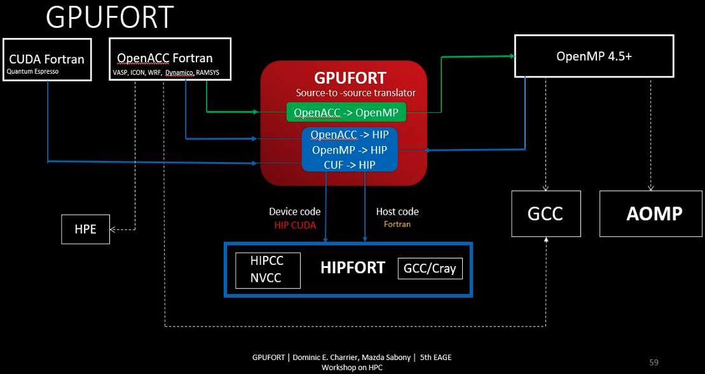

# Fortran

* First Scenario: Fortran + CUDA C/C++
    - Assuming there is no CUDA code in the Fortran files.
    - Hipify CUDA
    - Compile and link with hipcc
* Second Scenario: CUDA Fortran
    - There is no HIP equivalent
    - HIP functions are callable from C, using `extern C`
    - See hipfort


# Hipfort

The approach to port Fortran codes on AMD GPUs is different, the hipify tool
does not support it.

* We need to use hipfort, a Fortran interface library for GPU kernel
* Steps:
    1) We write the kernels in a new C++ file
    2) Wrap the kernel launch in a C function
    3) Use Fortran 2003 C binding to call the C function
    4) Things could change
* Use OpenMP offload to GPUs


# Fortran SAXPY example

- CUDA Fortran, 29 lines of code
- Ported to HIP manually
    - two files of 52 lines, with more than 20 new lines
    - quite a lot of changes for such a small code!
- Should we try to use OpenMP offload instead?
- Code available at:
  https://github.com/csc-training/hip-programming/hipfort


# Original CUDA Fortran

<small>
<div class="column">
```fortran
module mathOps
contains
  attributes(global) subroutine saxpy(x, y, a)
    implicit none
    real :: x(:), y(:)
    real, value :: a
    integer :: i, n
    n = size(x)
    i = blockDim%x * (blockIdx%x - 1) + threadIdx%x
    if (i <= n) y(i) = y(i) + a*x(i)
  end subroutine saxpy
end module mathOps
```
</div>

<div class="column">
```fortran
program testSaxpy
  use mathOps
  use cudafor
  implicit none
  integer, parameter :: N = 40000
  real :: x(N), y(N), a
  real, device :: x_d(N), y_d(N)
  type(dim3) :: grid, tBlock

  tBlock = dim3(256,1,1)
  grid = dim3(ceiling(real(N)/tBlock%x),1,1)

  x = 1.0; y = 2.0; a = 2.0
  x_d = x
  y_d = y
  call saxpy<<<grid, tBlock>>>(x_d, y_d, a)
  y = y_d
  write(*,*) 'Max error: ', maxval(abs(y-4.0))
end program testSaxpy
```
</div>
</small>


# New Fortran with HIP calls

<small>
<div class="column" style="width:46%">
```fortran
program testSaxpy
  use iso_c_binding
  use hipfort
  use hipfort_check

  implicit none
  interface
     subroutine launch(y,x,b,N) bind(c)
       use iso_c_binding
       implicit none
       type(c_ptr) :: y,x
       integer, value :: N
       real, value :: b
     end subroutine
  end interface

  type(c_ptr) :: dx = c_null_ptr
  type(c_ptr) :: dy = c_null_ptr
  integer, parameter :: N = 40000
  integer, parameter :: bytes_per_element = 4
  integer(c_size_t), parameter :: Nbytes = N*bytes_per_element
  real, allocatable,target,dimension(:) :: x, y

  real, parameter ::  a=2.0
  real :: x_d(N), y_d(N)
```
</div>

<div class="column" style="width:52%">
```fortran
  call hipCheck(hipMalloc(dx,Nbytes))
  call hipCheck(hipMalloc(dy,Nbytes))

  allocate(x(N))
  allocate(y(N))
  x = 1.0
  y = 2.0

  call hipCheck(hipMemcpy(dx, c_loc(x), Nbytes, hipMemcpyHostToDevice))
  call hipCheck(hipMemcpy(dy, c_loc(y), Nbytes, hipMemcpyHostToDevice))

  call launch(dy, dx, a, N)
  call hipCheck(hipDeviceSynchronize())
  call hipCheck(hipMemcpy(c_loc(y), dy, Nbytes, hipMemcpyDeviceToHost))

  write(*,*) 'Max error: ', maxval(abs(y-4.0))

  call hipCheck(hipFree(dx))
  call hipCheck(hipFree(dy))

  deallocate(x)
  deallocate(y)

end program testSaxpy
```
</div>
</small>


# HIP kernel + C wrapper

<small>
```c++
#include <hip/hip_runtime.h>
#include <cstdio>

__global__ void saxpy(float *y, float *x, float a, int n)
{
  size_t i = blockDim.x * blockIdx.x  + threadIdx.x;
  if (i < n) y[i] = y[i] + a*x[i];
}


extern "C"
{
  void launch(float **dout, float **da, float db, int N)
  {
    dim3 tBlock(256,1,1);
    dim3 grid(ceil((float)N/tBlock.x),1,1);

    hipLaunchKernelGGL((saxpy), grid, tBlock, 0, 0, *dout, *da, db, N);
  }
}
```
</small>

# GPUFort
    
1. Fortran+OpenACC and CUDA Fortran -> Fortran + OpenMP 4.5+
2. Fortran+OpenACC and CUDA Fortran -> Fortran + [GCC/AOMP OpenACC/MP runtime calls] + HIP C++
    
{width=1000px}


# GPUFort (II)

{width=1600px}


# GPUFort (III)

{width=1600px}

