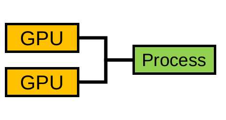
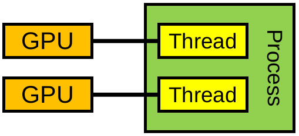

# Outline

* GPU context
* Device management
* Programming models
* Peer access (GPU-GPU)
* MPI+HIP


# Introduction

* Workstations or supercomputer nodes can be equipped with several GPUs
    * For the current supercomputers, the number of GPUs per node usually
      ranges between 2 to 6
    * Allows sharing (and saving) resources (disks, power units, e.g.)
    * More GPU resources per node, better per-node-performance


# GPU Context

* Context is established when the first HIP function requiring an active
  context is called (eg. `hipMalloc()`)
* Several processes can create contexts for a single device
* Resources are allocated per context
* By default, one context per device per process (since CUDA 4.0)
    * Threads of the same process share the primary context (for each device)


# Selecting device

* Driver associates a number for each HIP-capable GPU starting from 0
* The function `hipSetDevice()` is used for selecting the desired device


# Device management

```cpp
// Return the number of hip capable devices in `count`
hipError_t hipGetDeviceCount(int *count)

// Set device as the current device for the calling host thread
hipError_t hipSetDevice(int device)

// Return the current device for the calling host thread in `device`
hipError_t hipGetDevice(int *device)

// Reset and explicitly destroy all resources associated with the current device
hipError_t hipDeviceReset(void)
```


# Querying device properties

* One can query the properties of different devices in the system using
  `hipGetDeviceProperties()` function
    * No context needed
    * Provides e.g. name, amount of memory, warp size, support for unified
      virtual addressing, etc.
    * Useful for code portability

Return the properties of a HIP capable device in `prop`
```
hipError_t hipGetDeviceProperties(struct hipDeviceProp *prop, int device)
```


# Multi-GPU programming models

<div class="column">
* One GPU per process
    * Syncing is handled through message passing (eg. MPI)
* Many GPUs per process
    * Process manages all context switching and syncing explicitly
* One GPU per thread
    * Syncing is handled through thread synchronization requirements
</div>

<div class="column">
{width=50%}
{width=50%}
{width=50%}
</div>


# Multi-GPU, one GPU per process

* Recommended for multi-process applications using a message passing library
* Message passing library takes care of all GPU-GPU communication
* Each process interacts with only one GPU which makes the implementation
  easier and less invasive (if MPI is used anyway)
    * Apart from each process selecting a different device, the implementation
      looks much like a single-GPU program
* **Multi-GPU implementation using MPI is discussed at the end!**


# Multi-GPU, many GPUs per process

* Process switches the active GPU using `hipSetDevice()` function
* After setting the device, HIP-calls such as the following are effective only
  on the selected GPU:
    * Memory allocations and copies
    * Streams and events
    * Kernel calls
* Asynchronous calls are required to overlap work across all devices


# Many GPUs per process, code example

```cpp
for(unsigned int i = 0; i < deviceCount; i++)
{
  hipSetDevice(i);
  kernel<<<blocks[i],threads[i]>>>(arg1[i], arg2[i]);
}
```


# Multi-GPU, one GPU per thread

* One GPU per CPU thread
    * I.e one OpenMP thread per GPU being used
* HIP API is threadsafe
    * Multiple threads can call the functions at the same time
* Each thread can create its own context on a different GPU
    * `hipSetDevice()` sets the device and creates a context per thread
    * Easy device management with no changing of device
* Communication between threads becomes a bit more tricky


# One GPU per thread, code example

```cpp
#pragma omp parallel for
for(unsigned int i = 0; i < deviceCount; i++)
{
  hipSetDevice(i);
  kernel<<<blocks[i],threads[i]>>>(arg1[i], arg2[i]);
}
```


# Peer access

* Access peer GPU memory directly from another GPU
    * Pass a pointer to data on GPU 1 to a kernel running on GPU 0
    * Transfer data between GPUs without going through host memory
    * Lower latency, higher bandwidth

```cpp
// Check peer accessibility
hipError_t hipDeviceCanAccessPeer(int* canAccessPeer, int device, int peerDevice)

// Enable peer access
hipError_t hipDeviceEnablePeerAccess(int peerDevice, unsigned int flags)

// Disable peer access
hipError_t hipDeviceDisablePeerAccess(int peerDevice)
```


# Peer to peer communication

* Devices have separate memories
* With devices supporting unified virtual addressing, `hipMemCpy()` with
  `kind=hipMemcpyDefault`, otherwise, `hipMemcpyPeer()`:
```cpp
// First option with unified virtual addressing
hipError_t hipMemcpy(void* dst, void* src, size_t count, hipMemcpyKind kind)

// Other option which does not require unified virtual addressing
hipError_t hipMemcpyPeer(void* dst, int  dstDev, void* src, int srcDev, size_t count)
```

* If peer to peer access is not available, the functions result in a normal
  copy through host memory


# Message Passing Interface (MPI)

* MPI is a widely adopted standardized message passing interface for
  distributed memory parallel computing
* The parallel program is launched as a set of independent, identical
  processes
    * Same program code and instructions
    * Each process can reside in different nodes or even different computers
* All variables and data structures are local to the process
* Processes can exchange data by sending and receiving messages


# Three levels of parallelism

1. GPU - GPU threads on the multiprocessors
    * Parallelization strategy: HIP, SYCL, Kokkos, OpenMP
2. Node - Multiple GPUs and CPUs
    * Parallelization strategy: MPI, Threads, OpenMP
3. Supercomputer - Many nodes connected with interconnect
    * Parallelization strategy: MPI between nodes

{width=40%}


# MPI and HIP

* Trying to compile code with any HIP calls with other than the `hipcc`
  compiler can result in errors
* Either set MPI compiler to use `hipcc`, eg for OpenMPI:
```cpp
OMPI_CXXFLAGS='' OMPI_CXX='hipcc'
```
* or separate HIP and MPI code in different compilation units compiled with
  `mpicxx` and `hipcc`
    * Link object files in a separate step using `mpicxx` or `hipcc`


# MPI+HIP strategies

1. One MPI process per node
2. **One MPI process per GPU**
3. Many MPI processes per GPU, only one uses it
4. **Many MPI processes sharing a GPU**

* 2 is recommended (also allows using 4 with services such as CUDA MPS)
    * Typically results in most productive and least invasive implementation
      for an MPI program
    * No need to implement GPU-GPU transfers explicitly (MPI handles all
      this)
    * It is further possible to utilize remaining CPU cores with OpenMP (but
      this is not always worth the effort/increased complexity)


# Selecting the correct GPU

* Typically all processes on the node can access all GPUs of that node
* The following implementation allows utilizing all GPUs using one or more
  processes per GPU
    * Use CUDA MPS when launching more processes than GPUs

```cpp
int deviceCount, nodeRank;
MPI_Comm commNode;
MPI_Comm_split_type(MPI_COMM_WORLD, MPI_COMM_TYPE_SHARED, 0, MPI_INFO_NULL, &commNode);
MPI_Comm_rank(commNode, &nodeRank);
hipGetDeviceCount(&deviceCount);
hipSetDevice(nodeRank % deviceCount);
```


# GPU-GPU communication through MPI

* CUDA/ROCm aware MPI libraries support direct GPU-GPU transfers
    * Can take a pointer to device buffer (avoids host/device data copies)
* Unfortunately, currently no GPU support for custom MPI datatypes (must use a
  datatype representing a contiguous block of memory)
    * Data packing/unpacking must be implemented application-side on GPU
* ROCm aware MPI libraries are under development and there may be problems
    * It is a good idea to have a fallback option to use pinned host staging
      buffers


# Summary

- There are many options to write a multi-GPU program
- Use `hipSetDevice()` to select the device, and the subsequent HIP calls
  operate on that device
* If you have an MPI program, it is often best to use one GPU per process, and
  let MPI handle data transfers between GPUs
* There is still little experience from ROCm aware MPIs, there may be issues
    * Note that a CUDA/ROCm aware MPI is only required when passing device
      pointers to the MPI, passing only host pointers does not require any
      CUDA/ROCm awareness
