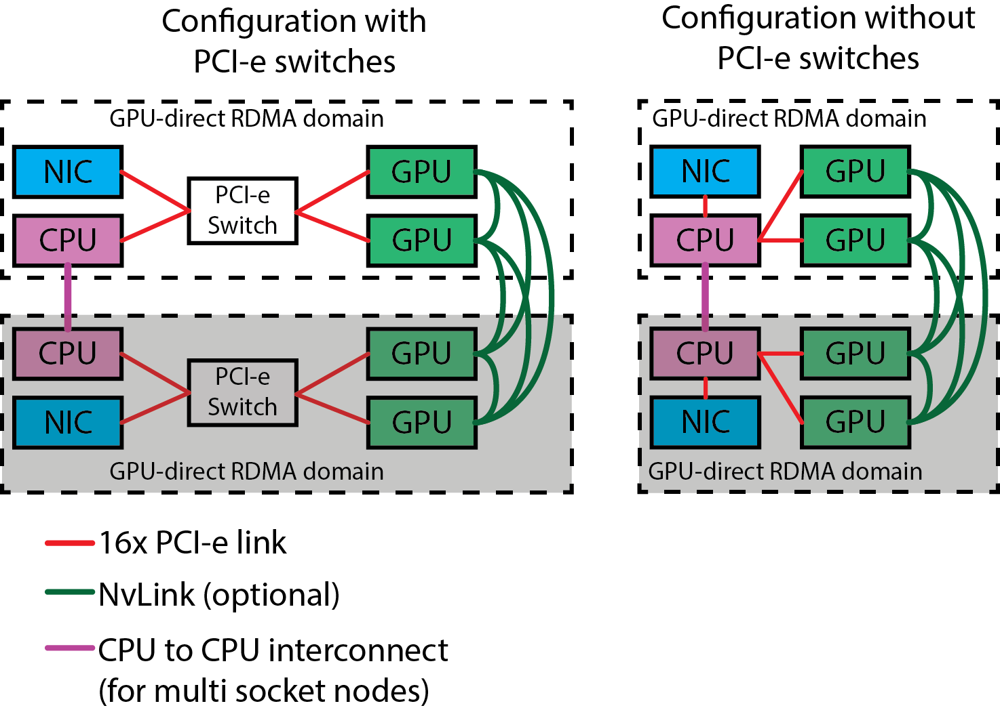
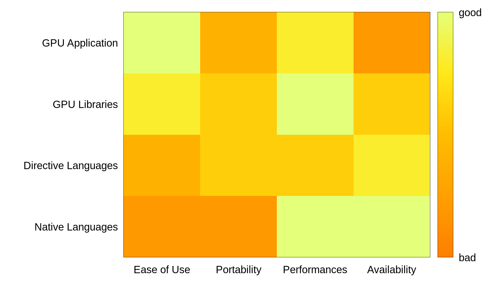

# High-performance computing

- High performance computing is fueled by ever increasing performance
- Increasing performance allows  breakthroughs in many major challenges that
  humankind faces today
- Not only hardware performance, algorithmic improvements have also added orders of magnitude of real performance

# HPC through the ages

- Achieving performance has been based on various strategies throughout the years
    - Frequency, vectorization, multi-node, multi-core ...
    - Now performance is mostly limited by power consumption
- Accelerators provide compute resources based on a very high level of parallelism to reach
  high performance at low relative power consumption

# Accelerators

- Specialized parallel hardware for floating point operations
    - Co-processors for traditional CPUs
    - Based on highly parallel architectures
    - Graphics processing units (GPU) have been the most common
      accelerators during the last few years
- Promises
    - Very high performance per node
- Usually major rewrites of programs required

# Flynn's taxonomy

- Proposed in 1966 to classify compute units

| | |
| ----------- | ----------- |
| {height=30%}    | {height=30%}|
| SISD   | MISD        |
| {height=30%}    | {height=30%}|
| SIMD   | MIMD        |
| | |

# Flynn's taxonomy

- Proposed in 1966 to classify compute units

| | |
| ----------- | ----------- |
| {height=30%}    | {height=30%}|
| CPU - 1 core   | Not Really used        |
| {height=30%}    | {height=30%}|
| GPU   | CPU - manycores        |
| | |

# Different design philosophies: CPU

**CPU**

- General purpose
- Low latency per thread
- Large area dedicated to caches and control
    - Good for control-flow
    - Great for task parallelism (MIMD)
- Less silicon dedicated at ALUs
    - Bad with parallel execution

{width=57%}

# Different design philosophies: GPU

**GPU**

- Most of the silicon dedicated to ALUs
    - Hundreds of floating-point execution units
    - Highly specialized for parallelism
- Great for data parallelism
- High-throughput
- Bad at control-flow processing

{width=70%}

# Lumi - Pre-exascale system in Finland

 {.center width=50%}

# Accelerator model today

- GPU is connected to CPUs via PCIe
- Local memory in GPU
    - Smaller than main memory (32 GB in Puhti)
    - Very high bandwidth (up to 3200 GB/s in LUMI)
    - Latency high compared to compute performance
- Data must be copied from CPU to GPU over the PCIe bus

{}
{width=100%}

#  Heterogeneous Programming Model

- GPUs are co-processors to the CPU
- CPU controls the work flow:
  - *offloads* computations to GPU by launching *kernels*
  - allocates and deallocates the memory on GPUs
  - handles the data transfers between CPU and GPUs
- CPU and GPU can work concurrently
   - kernel launches are normally asynchronous

# GPU architecture

- Designed for running tens of thousands of threads simultaneously on
  thousands of cores
- Very small penalty for switching threads
- Running large amounts of threads hides memory access penalties
- Very expensive to synchronize all threads

<small>AMD Instinct MI100 architecture (source: AMD)</small>

# Advance features & Performance considerations

- Memory accesses:
   - data resides in the GPU memory; maximum performance is achieved when reading/writing is done in continuous blocks
   - very fast on-chip memory can be used as a user programmable cache
- *Unified Virtual Addressing* provides unified view for all memory
- Asynchronous calls can be used to overlap transfers and computations.

# Challenges in using Accelerators

**Applicability**: Is your algorithm suitable for GPU?

**Programmability**: Is the programming effort acceptable?

**Portability**: Rapidly evolving ecosystem and incompatibilities between vendors.

**Availability**: Can you access a (large scale) system with GPUs?

**Scalability**: Can you scale the GPU software efficiently to several nodes?

# Using GPUs

1. Use existing GPU applications
2. Use accelerated libraries
3. Directive based methods
    - **OpenMP**, OpenACC
4. Use native GPU language
    - CUDA, HIP,

# Directive-based accelerator languages

- Annotating code to pinpoint accelerator-offloadable regions
- OpenACC
    - created in 2011, latest version is 3.1 (November 2020)
    - Mostly Nvidia
- OpenMP
    - Earlier only threading for CPUs
    - initial support for accelerators in 4.0 (2013), significant improvements & extensions in 4.5 (2015), 5.0 (2018), 5.1 (2020 and 5.2 (2021)

- Focus on optimizing productivity
- Reasonable performance with quite limited effort, but not guaranteed

# Native GPU code: HIP / CUDA

- CUDA
    - has been the *de facto* standard for native GPU code for years
    - extensive set of optimised libraries available
    - custom syntax (extension of C++) supported only by CUDA compilers
    - support only for NVIDIA devices
- HIP
    - AMD effort to offer a common programming interface that works on
      both CUDA and ROCm devices
    - standard C++ syntax, uses nvcc/hcc compiler in the background
    - almost a one-on-one clone of CUDA from the user perspective
    - ecosystem is new and developing fast

# Using GPUs

{.center width=70%}

# Directive languages and performances

- "Write once, run everywhere"
    - It is true that you get portability
    - It is *not* true that you get *performance* portability

- It is possible to optimize code for performance on GPU!
    - it will however be probably slower on the CPU

# GPUs @ CSC

- **Puhti-AI**: 80 nodes, total peak performance of 2.7 Petaflops
    - Four Nvidia V100 GPUs, two 20 cores Intel Xeon processors, 3.2 TB fast local storage, network connectivity of  200Gbps aggregate bandwidth  
- **Mahti-AI**: 24 nodes, total peak performance of 2. Petaflops
    - Four Nvidia A100 GPUs, two 64 cores AMD Epyc processors, 3.8 TB fast local storage,  network connectivity of  200Gbps aggregate bandwidth   
- **LUMI-G**: 2560 nodes, total peak performance of 500 Petaflops
    - Four AMD MI250X GPUs, one 64 cores AMD Epyc processors, 2x3 TB fast local storage, network connectivity of  800Gbps aggregate bandwidth

# Summary

- GPUs provide significant speed ups for certain applications
- GPUs are co-processors to CPUs
   - CPU offloads computations and manages memory
- High amount of parallelism required for efficient utilization of GPUs
- Programming GPUs
    - Directive based methods
    - CUDA, HIP
