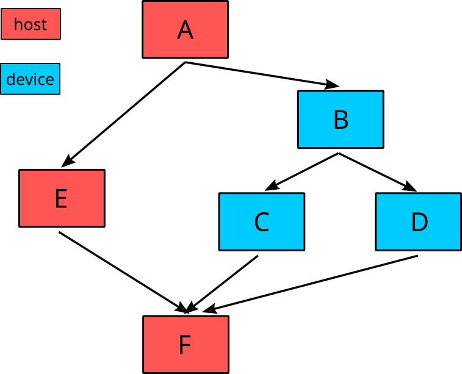

# Motivation

- By default, the host thread will wait until OpenMP `target` compute or data
  construct has completed its execution, *i.e.* there is an implicit
  barrier at the end of the `target`
- Potential parallelism in overlapping compute, data transfers, MPI,
  etc.

{.center}


# Asynchronous execution: nowait and taskwait

- `target` construct creates an implicit OpenMP task
- Similar to OpenMP explicit task constructs (`task`, `taskloop`), `target`
  has a `nowait` clause
    - removes the implicit barrier
- Completion can be ensured with the `taskwait` construct
- Work on host (concurrent to accelerator) can be parallelized with
  OpenMP tasks


# OpenMP and asynchronous execution

{.center}


# OpenMP and asynchronous execution

<div class=column>
```c
#pragma omp target nowait
process_in_device();

process_in_host();
#pragma omp taskwait
```
</div>

<div class=column>
```fortran
 !$omp target nowait
 call process_in_device();
 !$omp end target

 process_in_host();
 !$omp taskwait
```
</div>


# Task dependencies

- OpenMP tasks support data flow model, where a task can have input
  and output dependencies

<div class=column>
```c
// The two tasks can be executed concurrently
#pragma omp task
{do something}

#pragma omp task
{do something else}
```
</div>

<div class=column>
```c
// The two tasks can be executed concurrently
#pragma omp task depend(out:a)
{do something which produces a}

#pragma omp task depend(in:a)
{do something which uses a as input}
```
</div>

- Also `target` tasks support dependencies


# Task dependencies

<div class=column>
<small>
```c
#pragma omp task depend(out: A)
 {Code A}
#pragma omp target depend(in: A) depend(out: B) \
 nowait
 {Code B}
#pragma omp target depend(in: B) depend(out: C) \
 nowait
 {Code C}
#pragma omp target depend(in: B) depend(out: D) \
 nowait
 {Code D}
#pragma omp task depend(in: A) depend(in: A)
  {Code E}
#pragma omp task depend(in: C,D,E)
  {Code F}
```
</div>
</small>

<div class=column>
{.center width=80%}
</div>


# Task dependencies

- Dependencies may be specifief also for a part of an array

```c
// Preocessing array in blocks
for (int ib = 0; ib < n; ib += bf) {
  #pragma omp ... depend(out:A[ib*bf]) nowait
  {Processing step 1}
  #pragma omp ... depend(in:A[ib*bf]) nowait
  {Processing step 2}
}
```


# Summary

- `target` construct creates an implicit OpenMP task
- OpenMP task functionalities (`nowait`, `taskwait`, `depend`) can
  be used for asynchronous execution on accelerators
- May enable better performance by overlapping different operations
    - Performance depends heavily on the underlying implementation
