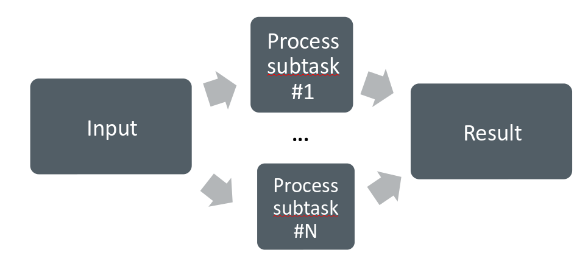

# Parallel computing concepts {.section}

# Computing in parallel

- Serial computing
    - Single processing unit ("core") is used for solving a problem

{.center width=105%}

# Computing in parallel

- Parallel computing
    - A problem is split into smaller subtasks
    - Multiple subtasks are processed *simultaneously* using multiple
      cores
{.center width=120%}

# Exposing parallelism

- Data parallelism
    - Data is distributed to processor cores
    - Each core performs simultaneously (nearly) identical operations with
      different data
    - Especially good on GPUs(!)
- Task parallelism
    - Different cores perform different operations with (the same or)
      different data
- These can be combined

{ }

# Parallel scaling

- Strong parallel scaling
   - Constant problem size
   - Execution time decreases in proportion to the increase in the number
     of cores
- Weak parallel scaling
   - Increasing problem size
   - Execution time remains constant when number of cores increases in
     proportion to the problem size

{ }

# Amdahl's law

- Parallel programs often contain sequential parts
- *Amdahl's law* gives the maximum speed-up in the presence of
  non-parallelizable parts
- Main reason for limited strong scaling

Maximum speed-up is
$$
S=\frac{1}{ ( 1-F) + F/N}
$$
where $F$ is the parallel fraction and $N$ is the number of cores

{ }

# Parallel computing concepts

- Load balance
    - Distribution of workload to different cores
- Parallel overhead
    - Additional operations which are not present in serial calculation
    - Synchronization, redundant computations, communications
