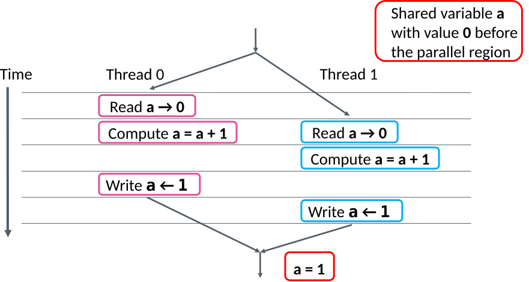
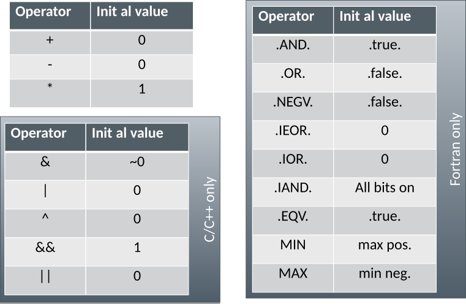

# Race condition

- Race conditions take place when multiple threads read and write a variable
  simultaneously, for example:

```fortran
asum = 0.0d0
!$omp parallel do shared(x,y,n,asum) private(i)
  do i = 1, n
     asum = asum + x(i)*y(i)
  end do
!$omp end parallel do
```

- Random results depending on the order the threads access **asum**
- We need some mechanism to control the access


# Race condition: example




# Reductions

- Summing elements of array is an example of reduction operation

{.center width=70%}

FIXME: missing figure?

- OpenMP provides support for common reductions within parallel regions and
  loops with the reduction clause


# Reduction clause

`reduction(operator:list)`
  : Performs reduction on the (scalar) variables in list

- Private reduction variable is created for each thread's partial result
- Private reduction variable is initialized to operator's initial value
- After parallel region the reduction operation is applied to private
  variables and result is aggregated to the shared variable


# Reduction operators




# Race condition avoided with reduction

```fortran
!$omp parallel do shared(x,y,n) private(i) reduction(+:asum)
  do i = 1, n
     asum = asum + x(i)*y(i)
  end do
!$omp end parallel do
```
```c
#pragma omp parallel for shared(x,y,n) private(i) reduction(+:asum)
for(i=0; i < n; i++) {
    asum = asum + x[i] * y[i];
}
```


# Execution controls

* Sometimes a part of parallel region should be executed only by the master thread or by a single thread at time
    - IO, initializations, updating global values, etc.
    - Remember the synchronization!
* OpenMP provides clauses for controlling the execution of code blocks

# Failing example

```c
#pragma omp parallel shared(global_counter), private(tnum, delay, rem)
{
  tnum = omp_get_thread_num();
  delay.tv_sec = 0;
  delay.tv_nsec = 10000 * tnum;
  do {
    printf("This is iteration %i\n", global_counter);
    global_counter++; /* Race condition! */
    nanosleep(&delay, &rem);
  } while(global_counter < 10);
}
```

# Execution control constructs

* **barrier**
    - When a thread reaches a barrier it only continues after all the threads in the same thread team have reached it
        * Each barrier must be encountered by all threads in a team, or none at all
        * The sequence of work-sharing regions and barrier regions encountered must be same for all threads in team
    - Implicit barrier at the end of: do, parallel, sections, single, workshare

# Execution control constructs

* **master**
    - Specifies a region that should be executed only by the master thread
    - Note that there is no implicit barrier at end
* **single**
    - Specifies that a regions should be executed only by a single (arbitrary) thread
    - Other threads wait (implicit barrier)

# Execution control constructs

* **critical[(name)]**
    - A section that is executed by only one thread at a time
    - Optional name specifies global identifier for critical section
    - Unnamed critical sections are treated as the same section
* **flush[(name)]**
    - Synchronizes the memory of all threads
    - Only needed in some special cases
    - Implicit flush at
        * All explicit and implicit barriers
        * Entry to / exit from critical section and lock routines

# Execution control constructs
* **atomic**
    - Strictly limited construct to update a single value, can not be applied to code blocks
    - Only guarantees atomic update, does not protect function calls
    - Can be faster on hardware platforms that support atomic updates

# Example: reduction using critical section

```fortran
!$OMP PARALLEL SHARED(x,y,n,asum) PRIVATE(i, psum)
  psum = 0.0d
  !$OMP DO
  do i = 1, n
    psum = psum + x(i)*y(i)
  end do
  !$OMP END DO
  !$OMP CRITICAL(dosum)
  asum = asum + psum
  !$OMP END CRITICAL(dosum)
!$OMP END PARALLEL
```

# Example: initialization and output

```c
int total = 0;
#pragma omp parallel shared(total) private(sum,new)
{
#pragma omp single
  initialise();

  int new, sum = 0;
  do {
    new = compute_something();
    sum += new;
  } while (new);
#pragma omp critical(addup)
  total += sum;
#pragma omp master
  printf("Grand total is: %5.2f\n", total);
}
```
# OpenMP runtime library and environment variables {.section}

# OpenMP runtime library and environment variables

* OpenMP provides several means to interact with the execution environment. These operations include e.g.
    - Setting the number of threads for parallel regions
    - Requesting the number of CPUs
    - Changing the default scheduling for work-sharing clauses
* Improves portability of OpenMP programs between different architectures (number of CPUs, etc.)

# Environment variables

* OpenMP standard defines a set of environment variables that all implementations have to support
* The environment variables are set before the program execution and they are read during program start-up
    - Changing them during the execution has no effect
* We have already used `OMP_NUM_THREADS`

# Runtime functions

* Runtime functions can be used either to read the settings or to set (override) the values
* Function definitions are in
    - C/C++ header file `omp`.h
    - `omp_lib` Fortran module (`omp_lib`.h header in some implementations)
* Two useful routines for distributing work load:
    - `omp_get_num_threads()`
    - `omp_get_thread_num()`

# List of environment variables (OpenMP 4.5)

<div class=column>
`OMP_SCHEDULE`
`OMP_NUM_THREADS`
`OMP_DYNAMIC`
`OMP_PROC_BIND`
`OMP_PLACES`
`OMP_NESTED`
`OMP_STACKSIZE`
`OMP_WAIT_POLICY`
`OMP_MAX_TASK_PRIORITY`
</div>

<div class=column>
`MP_MAX_ACTIVE_LEVELS`
`OMP_THREAD_LIMIT`
`OMP_CANCELLATION`
`OMP_DISPLAY_ENV`
`OMP_DEFAULT_DEVICE`
</div>

# Some useful environment variables

|Variable        | Action                             |
|---------       |------------------                        |
|OMP_NUM_THREADS   |Number of threads to use                       |
|OMP_SCHEDULE       |Default scheduling                           |
|OMP_PROC_BIND       |Bind threads to CPUs                       |
|OMP_PLACES       |Specify the bindings between threads and CPUs           |
|OMP_DISPLAY_ENV   |Print the current OpenMP environment info on stderr           |
|OMP_STACKSIZE       |Default size of thread stack                   |
|OMP_THREAD_LIMIT  |Maximum number of threads to use                   |

# Parallelizing a loop with library functions

**Don't use this in production!**

```c
#pragma omp parallel private(i,nthrds,thrd)
{
  nthrds = omp_get_num_threads();
  thrd = omp_get_thread_num();
  for(i = thrd; i < n; i += nthrds) {
    vec_c[i] = vec_a[i] + vec_b[i];
  }
}
```

# Fixed example

```c
#pragma omp parallel shared(global_counter), private(tnum, delay, rem)
{
  tnum = omp_get_thread_num();
  delay.tv_sec = 0;
  delay.tv_nsec = 10000 * tnum;
  do {
#pragma omp barrier
#pragma omp single {
      printf("This is iteration %i\n", global_counter);
      global_counter++;
    }
    nanosleep(&delay, &rem);
  } while(global_counter < 10);
}

```

# Summary

- Race condition when accessing shared variables
    - Reduction clause
- OpenMP has many synchronization pragmas
    - Critical sections
    - Atomic
    - Single and Master
    - And some that we did not present (yet)
- OpenMP runtime behavior can be controlled using environment variables
