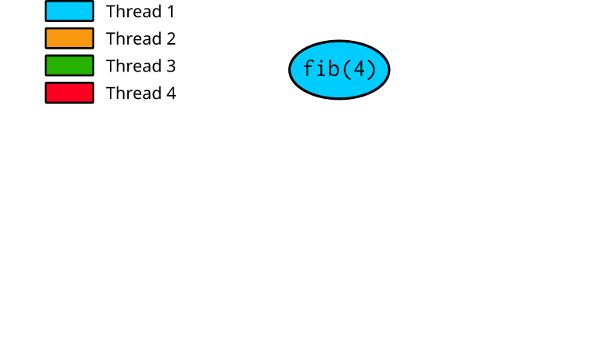
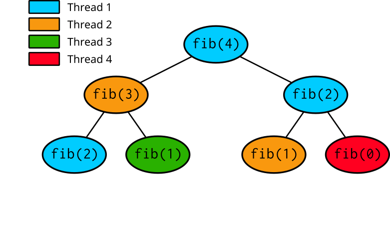
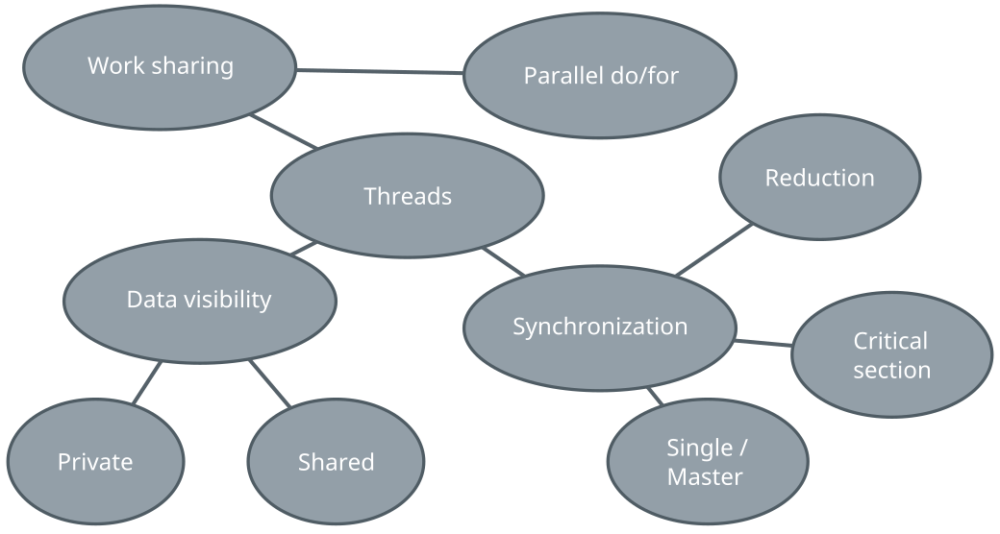

# Task parallelisation {.section}


# Limitations of work sharing so far

- Number of iterations in a loop must be constant
    - No while loops or early exits in for/do loops
- All the threads have to participate in workshare
- OpenMP tasks enable parallelisation of irregular and dynamical patterns
    - While loops
    - Recursion


# What is a task in OpenMP?

- A task has
    - Code to execute
    - Data environment
    - Internal control variables
- Tasks are added to a task queue, and executed then by a single thread
    - Can be same or different thread that created the task
    - OpenMP runtime takes care of distributing tasks to threads


# OpenMP task construct

- Create a new task and add it to task queue
    - Memorise data and code to be executed
    - Task constructs can be arbitrarily nested
- Syntax (C/C++)

    ```c
    #pragma omp task [clause[[,] clause],...]
    {
        ...
    }
    ```

- Syntax (Fortran)

    ```fortran
    !$omp task[clause[[,] clause],...]
    ...
    !$omp end task
    ```


# OpenMP task construct

- All threads that encounter the construct create a task
- Typical usage pattern is thus that single thread creates the tasks

```c
#pragma omp parallel
#pragma omp single
{
    int i=0;
    while (i < 12) {
        #pragma omp task
        {
            printf("Task %d by thread %d\n", i, omp_get_thread_num());
        }
        i++;
    }
}
```


# OpenMP task construct

How many tasks does the following code create when executed with 4 threads?
<br>
`a) 6  b) 4  c) 24`

```c
#pragma omp parallel
{
    int i=0;
    while (i < 6) {
        #pragma omp task
        {
            do_some_heavy_work();
        }
        i++;
    }
}

```


# Task execution model

- Tasks are executed by an arbitrary thread
    - Can be same or different thread that created the task
    - By default, tasks are executed in an arbitrary order
    - Each task is executed only once
- Synchronisation points
    - Implicit or explicit barriers
    - `#pragma omp taskwait / !$omp taskwait`
        - Encountering task suspends until child tasks complete


# Data environment of a task

- Tasks are created at one time, and executed at another
    - What data does the task see when executing?
- Variables that are `shared` in the enclosing construct contain the data at
  the time of execution
- Variables that are `private` in the enclosing construct are made
  `firstprivate` and contain the data at the time of creation
- Data scoping clauses (`shared`, `private`, `firstprivate`, `default`) can
  change the default behaviour


# Recursive algorithms with tasks

- A task can itself generate new tasks
    - Useful when parallelising recursive algorithms
- Recursive algorithm for Fibonacci numbers:
  $F_0=0, \quad F_1=1, \quad F_n = F_{n-1} + F_{n-2}$

<div class=column>
```c
#pragma omp parallel
{
    #pragma omp single
    fib(10);
}
```
</div>

<div class=column>
```c
int fib(int n) {
    int fn, fnm;
    if (n < 2)
        return n;
    #pragma omp task shared(fn)
    fn = fib(n-1);
    #pragma omp task shared(fnm)
    fnm = fib(n-2);
    #pragma omp taskwait
    return fn+fnm;
}
```
</div>

# Tasking illustrated

<div class=column>
- Thread 1 enters `fib(4)`
</div>

<div class=column>
{.center width=90%}
</div>

# Tasking illustrated

<div class=column>
- Thread 1 enters `fib(4)`
- Thread 1 creates tasks for `fib(3)` and `fib(2)`
</div>

<div class=column>
{.center width=90%}
</div>

# Tasking illustrated

<div class=column>
- Thread 1 enters `fib(4)`
- Thread 1 creates tasks for `fib(3)` and `fib(2)`
- Threads 1 and 2 execute tasks from the queue and create four new tasks
</div>

<div class=column>
{.center width=90%}
</div>

# Tasking illustrated

<div class=column>
- Thread 1 enters `fib(4)`
- Thread 1 creates tasks for `fib(3)` and `fib(2)`
- Threads 1 and 2 execute tasks from the queue and create four new tasks
- Threads 1-4 execute tasks
</div>

<div class=column>
{.center width=90%}
</div>

# Tasking illustrated

<div class=column>
- Thread 1 enters `fib(4)`
- Thread 1 creates tasks for `fib(3)` and `fib(2)`
- Threads 1 and 2 execute tasks from the queue and create four new tasks
- Threads 1-4 execute tasks
- ...
</div>

<div class=column>
{.center width=90%}
</div>


# OpenMP programming best practices

- Maximise parallel regions
    - Reduce fork-join overhead, e.g. combine multiple parallel loops into one
      large parallel region
    - Potential for better cache re-usage
- Parallelise outermost loops if possible
    - Move PARALLEL DO construct outside of inner loops
- Reduce access to shared data
    - Possibly make small arrays private
- Use more tasks than threads
    - Too large number of tasks leads to performance loss


# OpenMP summary

- OpenMP is an API for thread-based parallelisation
    - Compiler directives, runtime API, environment variables
    - Relatively easy to get started but specially efficient and/or real-world
      parallelisation non-trivial
- Features touched in this intro
    - Parallel regions and work sharing constructs
    - Data-sharing clauses
    - Combining MPI and OpenMP
    - Task based parallelisation


# OpenMP summary




# Things that we did not cover

- sections construct
- critical and atomic constructs
- scheduling clauses of `for`/`do` constructs
- task dependencies
- taskgroup and taskloop constructs
- simd construct
- ...


# Web resources

- OpenMP homepage: <http://openmp.org/>
- Online tutorials: <http://openmp.org/wp/resources/#Tutorials>
