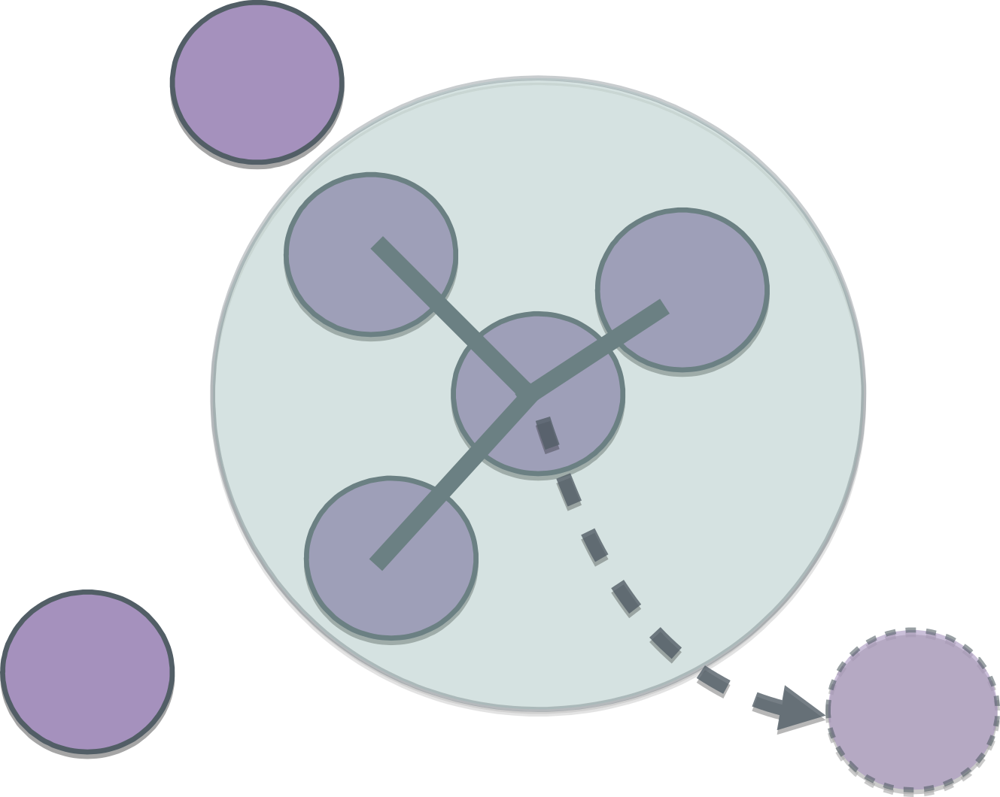
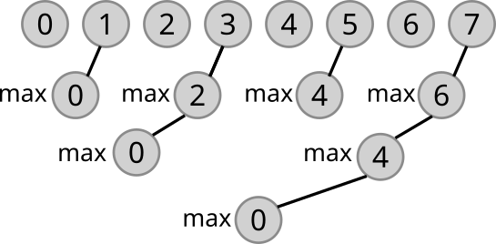
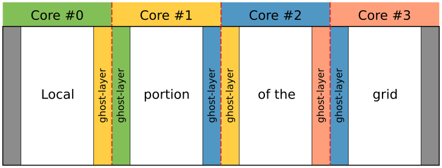
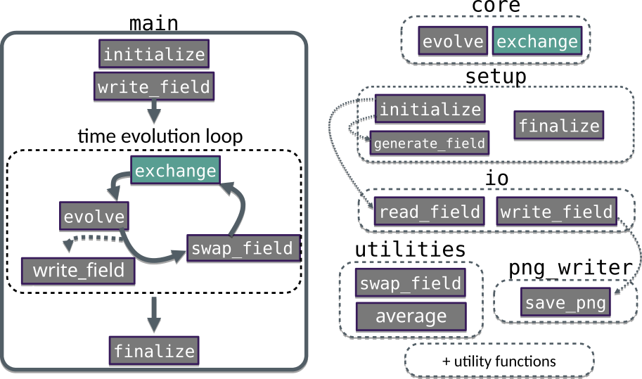

# Parallel algorithms {.section}

# What can be calculated in parallel?

- There needs to be independent computations

<div class=column>
Gauss-Seidel iteration:
<small>
```
while True
  for i:
    u[i] = (u[i-1]) + u[i+1]) - h**2 f[i]) / 2

until converged(u)
```
</small>

- cannot be parallelized due to data dependency

</div>
<div class=column>
Jacobi iteration:
<small>
```
while True
  for i:
    u_new[i] = (u_old[i-1]) + u_old[i+1]) - h**2 f[i]) / 2
  swap(u_new, u_old)
until converged(u)
```
</small>

- can be parallelized

</div>

# Data distribution

- Single node cannot typically hold all the data of large simulation
    - Data needs to be distributed
    - Data is often logically distributed also inside the node
- Computations may require data from other execution data
    - *Local* dependencies: data is needed only from few other units
    - *Global* dependencies: data is needed from all the execution units
- Data distribution should try to minimize communication time
- Data distribution should try to maximize load balance

# Data distribution: local vs. global dependencies

<div class=column>
Local dependencies

- Stencils: 

<small>
```
v[i,j] = u[i-1, j] + u[i+1, j] + u[i, j-1] ...
```
</small>

- Finite elements methods
- Particle based methods with short range interactions
- Number of communications remains constant
</div>
<div class=column>
Global dependencies

- Fourier transform 

<small>
  $X_k = \sum_{n=0}^{N-1} x_n \exp(-i \frac{2\pi}{N}k \cdot n)$
</small>

- Linear algebra: $C = A \times B$

<!-- Copyright CSC -->
{.center width=50%}

- Number of communication events increases with number of execution units

# Data distribution: load balance

<div class=column>
Simple domains with similar computational cost

<br>
<!-- Copyright CSC -->
{.center width=50%}
</div>

<div class=column>
Simple domains with different computational cost

<br>
<!-- Copyright CSC -->
{.center width=40%}
</div>

# Data distribution: load balance

<div class=column>
Complex FEM meshes
<br>
<br>
<!-- Copyright CSC / Peter Råback -->
{.center width=70%}
</div>

<div class=column>
Moving particles
<br>
<br>
<!-- Copyright CSC -->
{.center width=70%}
</div>

# Communication: latency and bandwidth

- Each communication event has a constant cost: latency
- One should try to communicate large batches of data at once
   - All the boundary data needed within an iteration
   - All the particles needed within an iteration
- Sometimes it is possible to overlap communication and computation
   - Might require proper hardware support

<small>
<div class=column>
```
for iter:
   exchange()
   compute()
```
</div>
<div class=column>
```
for iter:
   exchange_init()
   compute_first()
   exchange_finalize()
   compute_second()
```
</div>
</small>

# Communication to computation ratio

- Communication to computation ratio is important metric for scalability
    - If ratio increases, algorithm stops scaling with certain number of processors
- Example: square grid with dimension $N$, $p$ processors
    - Computational cost: $\frac{N^2}{p}$

<div class=column>
One dimensional decomposition
<small>

- Communication of boundary has constant cost $N$
- Ratio: $\frac{T_{comm}}{T_{comp}} = \frac{p}{N}$

</small>
</div>
<div class=column>
Two dimensional decomposition
<small>

- Communication of boundary has cost $\frac{N}{\sqrt{p}}$
- Ratio: $\frac{T_{comm}}{T_{comp}} = \frac{\sqrt{p}}{N}$

</small>
</div>

# Reductions

- Reduction is an operation that combines data from multiple execution units
  into a single number
    - Typical reduction operations: **sum**, **product**, **max**, **min**
- Many parallel algorithms need reductions *e.g.* integrals over domains
- Many parallel programming libraries provide efficient implementations for reduction

<div class=column>
Simple
{.center width=50%}
</div>
Tree
<div class=column>
{.center width=50%}
</div>

# Case study: heat equation {.section}

# Heat equation

<div class=column>

- Partial differential equation that describes the variation of temperature in a given region over time

$$\frac{\partial u}{\partial t} = \alpha \nabla^2 u$$

- Temperature variation: $u(x, y, z, t)$
- Thermal diffusivity constant: $\alpha$

</div>

<div class=column>

 {.center width=60%}

</div>


# Numerical solution


- Discretize: Finite difference Laplacian in two dimensions

 <small>
 $$\nabla^2 u \rightarrow \frac{u(i-1,j)-2u(i,j)+u(i+1,j)}{(\Delta x)^2}
  + \frac{u(i,j-1)-2u(i,j)+u(i,j+1)}{(\Delta y)^2} $$
</small>
Temperature field $u(i,j)$

 {.center width=45%}


# Time evolution


- Explicit time evolution with time step Δt

$$u^{m+1}(i,j) = u^m(i,j) + \Delta t \alpha \nabla^2 u^m(i,j)$$

- Note: algorithm is stable only when

$$\Delta t < \frac{1}{2 \alpha} \frac{(\Delta x \Delta y)^2} pull $$

- Given the initial condition ($u(t=0) = u^0$) one can follow the time evolution of the temperature field

# Solving heat equation in parallel

- Temperature at each grid point can be updated independently
- Data can be distributed with domain decomposition

 {.center width=60%}

# Solving heat equation in parallel

- Local data dependency: communication is needed for boundary layers
- Information about neighbouring domains is stored in ”ghost layers”

 {.center width=50%}

- Before each update cycle, CPU cores communicate boundary data: <br>halo exchange

# Serial code structure

 {.center width=70%}

# Parallel code structure

 {.center width=70%}
