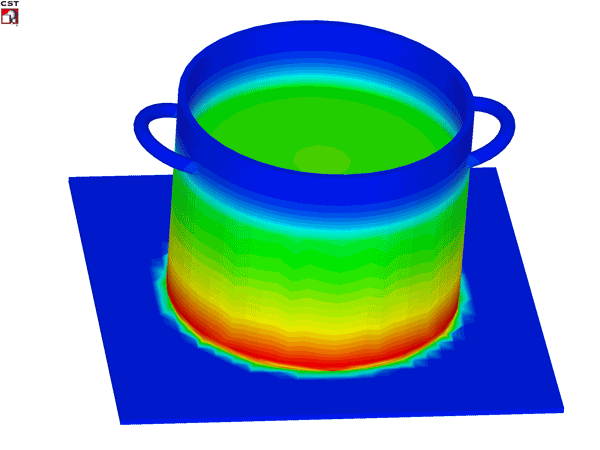

# Smoothed Particle Hydrodynamic simulation

* Particles are hard spheres
* They interact with neighbours inside some effective range
	- This way the particles appear “viscous”
* See live demo with Sisunen

 {.center width=80%}

# Group work assignment

* Within your table group, discuss the Smoothed Particle Hydrodynamic (SPH) problem
* Make back-of-an-envelope sketches, etc, on how would you parallelize the selected problem
	- Which parts of the work can be carried out independently and in parallel?
	- What kind of coordination between the parallel threads will be needed?
* If you come up with several approaches, discuss their pros and cons

# Case study: heat equation {.section}

# Heat equation

* Partial differential equation that describes the variation of temperature in a given region over time

 {.center width=25%}	
		
* Temperature variation: u(x, y, z, t)
* Thermal diffusivity constant: α

 {.center width=60%}

# Numerical solution

* Discretize: Finite difference Laplacian in two dimensions

 {.center width=70%}

Temperature field u(i,j)

 {.center width=45%}

# Time evolution

* Explicit time evolution with time step Δt

{.center width=70%}

* Note: algorithm is stable only when

 {.center width=40%}

* Given the initial condition (u(t=0) = u0) one can follow the time evolution of the temperature field

# Solving heat equation in parallel

* Temperature at each grid point can be updated independently
* Domain decomposition

 {.center width=60%}
 
* Straightforward in shared memory computer

# Solving heat equation in parallel

* In distributed memory computers, each core can access only its own memory

* Information about neighbouring domains is stored in ”ghost layers”

 {.center width=50%}

* Before each update cycle, CPU cores communicate boundary data: halo exchange

# Serial code structure

 {.center width=70%}

# Parallel code structure

 {.center width=70%}
