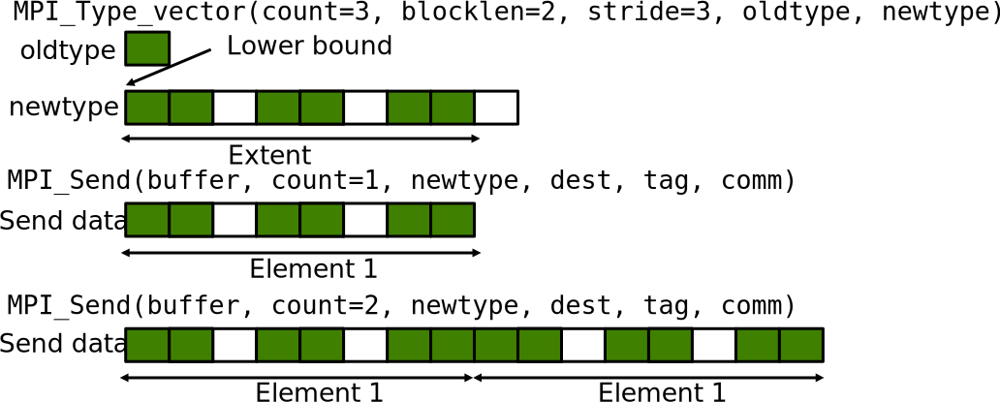
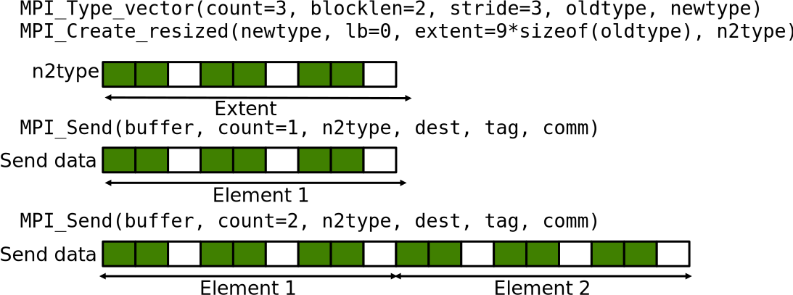
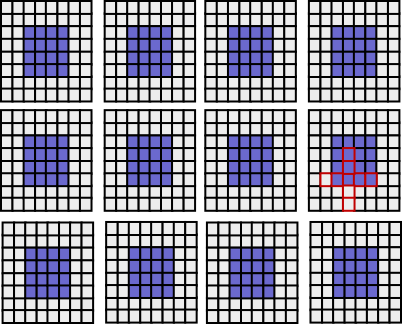
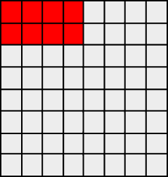

# Typemaps & describing heterogeneous data  {.section}

# Understanding datatypes: typemap

- A datatype is defined by a _typemap_
    - Typemap consists of pairs with basic types and displacements (in
      bytes)
    - E.g. MPI_INT={(int,0)}

<p>
{.center width=100%}

# Datatype constructors: MPI_TYPE_CREATE_STRUCT

- The most general type constructor, creates a new type from
  heterogeneous blocks
    - E.g. Fortran types and C structures
    - Input is the typemap

<p>
{.center width=70%}

# Datatype constructors: MPI_TYPE_CREATE_STRUCT {.split-definition}

MPI_Type_create_struct(`count`{.input}, `blocklens`{.input}, `displs`{.input}, `types`{.input}, `newtype`{.output})
  : `count`{.input}
    : number of blocks

    `blocklens`{.input}
    : lengths of blocks (array)

    `displs`{.input}
    : displacements of blocks in bytes (array)

    `types`{.input}
    : types of blocks (array)

    `newtype`{.output}
    : resulting new datatype
    
    `-`{.ghost}
    : `-`{.ghost}

<p>
{.center width=70%}

# Example: sending a C struct

```c
/* Structure for particles */
struct ParticleStruct {
   int charge;         /* particle charge */ 
   double coord[3];    /* particle coords */ 
   double velocity[3]; /* particle velocity vector components */ };
 
struct ParticleStruct particle[1000];
MPI_Datatype Particletype;

MPI_Datatype type[3] = {MPI_INT, MPI_DOUBLE, MPI_DOUBLE};
int blocklen[3] = {1, 3, 3};
MPI_Aint disp[3] = {0, sizeof(double), 4*sizeof(double)};
...
MPI_Type_create_struct(3, blocklen, disp, type, &Particletype);
MPI_Type_commit(&Particletype);

MPI_Send(particle, 1000, Particletype, dest, tag, MPI_COMM_WORLD);
MPI_Type_free(&Particletype);
```

# Determining displacements

- The previous example defines and assumes a certain _alignment_ for the
  data within the structure
- The displacements can (and should!) be determined by using the
  function **`MPI_Get_address`(`pointer`{.input},
  `address`{.output})**
    - The address of the variable is returned, which can then be used
      for determining relative displacements

# Determining displacements

```c
/* Structure for particles */ 
struct ParticleStruct { 
   int charge;         /* particle charge */
   double coords[3];   /* particle coords */ 
   double velocity[3]; /* particle velocity vector components */ };

struct ParticleStruct particle[1000];
...
MPI_Aint disp[3]; /*Note the address type - MPI_Aint in C, integer(mpi_address_kind) in Fortran*/
MPI_Get_address(&particle[0].charge, &disp[0]);
MPI_Get_address(&particle[0].coords, &disp[1]);
MPI_Get_address(&particle[0].velocity, &disp[2]);
/* Make displacements relative */
disp[2] -= disp[0];
disp[1] -= disp[0];
disp[0] = 0;
...

```

# Gaps between datatypes

- Sending of an array of the `ParticleStruct` structures may have a
  portability issue: it assumes that array elements are packed in
  memory
    - Implicit assumption: the extent of the datatype was the same as
      the size of the C struct
    - This is not necessarily the case
- If there are gaps in memory between the successive structures,
  sending does not work correctly

# TYPE EXTENT {.section}

# Sending multiple elements: Extent

- Sending multiple user-defined types at once may not behave as expected
- The _lower bound_ describes where the datatype starts
    - LB: min(disp~j~)
- The _extent_ describes the stride at which contiguous elements are
  read or written when sending multiple elements
    - Extent = max(disp~j~ + size~j~) – LB + padding

# Multiple MPI_TYPE_VECTOR

{.center width=80%}

# Reading extent and lower bound

MPI_Type_get_extent(`type`{.input}, `lb`{.output}, `extent`{.output})
  : `type`{.input}
    : Datatype
  : `lb`{.output}
    : Lower bound of type (in bytes)
  : `extent`{.output}
    : Extent of type (in bytes)

# Setting new extent and lower bound

MPI_Type_create_resized(`type`{.input}, `lb`{.input}, `extent`{.input}, `newtype`{.output})
  : `type`{.input}
    : Old datatype
  : `lb`{.input} 
    : New lower bound (in bytes)
  : `extent`{.input}
    : New extent (in bytes)
  : `newtype`{.output}
    : New datatype, commit before use

# Multiple MPI_TYPE_VECTOR

{.center width=80%}

# Example: sending an array of structs portably

```c
struct ParticleStruct particle[1000];
MPI_Datatype particletype, oldtype;
MPI_Aint lb, extent;
...
// Check that the extent is correct
MPI_Type_get_extent(particletype, &lb, &extent);
if ( extent != sizeof(particle[0] ) {
   oldtype = particletype;
   MPI_Type_create_resized(oldtype, 0, sizeof(particle[0]),
                           &particletype);
   MPI_Type_commit(&particletype);
   MPI_Type_free(&oldtype);
}
...
```

# Other ways of communicating non-uniform data

- Non-contiguous data by manual packing
    - Copy data into or out from temporary buffer
    - Use MPI_Pack and MPI_Unpack functions
    - Performance will likely be an issue
- Structures and types as continuous stream of bytes: Communicate
  everything using MPI_BYTE
    - Portability can be an issue - be careful

<p>
```c
struct ParticleStruct particle[1000];
int psize;
psize = sizeof(particle[0]);
MPI_Send(particle, 1000*psize, MPI_BYTE, ...);
```

# SUBARRAY TYPE {.section}

# MPI_TYPE_CREATE_SUBARRAY {.split-def-3}

<!--- Creates a type describing an N-dimensional subarray within an N-dimensional array
-->
MPI_Type_create_subarray(`ndims`{.input}, `sizes`{.input}, `subsizes`{.input}, `offsets`{.input}, `order`{.input}, `oldtype`{.input}, `newtype`{.output})
  : `ndims`{.input}
    : number of array dimensions
    
    `sizes`{.input}
    : number of array elements in each dimension (array)
  
    `subsizes`{.input}
    : number of subarray elements in each dimension (array)

    `offsets`{.input}
    : starting point of subarray in each dimension (array)

    `order`{.input}
    : storage order of the array. Either `MPI_ORDER_C` or
      `MPI_ORDER_FORTRAN`
  
    `oldtype`{.input}
    : oldtype
    
    `newtype`{.output}
    : resulting type

    `-`{.ghost}
    : `-`{.ghost}

# Example: subarray

<div class=column>
```c
int a_size[2]    = {5,5};
int sub_size[2]  = {2,3};
int sub_start[2] = {1,2};
MPI_Datatype sub_type;
double array[5][5];
    
for(i = 0; i < a_size[0]; i++)
  for(j = 0; j < a_size[1]; j++)
    array[i][j] = rank; 
MPI_Type_create_subarray(2, a_size, sub_size,
  sub_start, MPI_ORDER_C, MPI_DOUBLE, &sub_type);
MPI_Type_commit(&sub_type);
if (rank==0)
  MPI_Recv(array[0], 1, sub_type, 1, 123,
    MPI_COMM_WORLD, MPI_STATUS_IGNORE);
if (rank==1) 
  MPI_Send(array[0], 1, sub_type, 0, 123,
  MPI_COMM_WORLD);

```
</div>
<div class=column>
{.center width=100%}
</div>

# Example: halo exchange with user defined types

<div class=column>
- A solver requires a stencil of two cells in each direction to
  compute the next timestep
- The distributed 2D grid
    - Two-element ghost layers,each process has allocated a 8 x 8 grid
      patch
    - Each process computes a 4 x 4 patch of total system
    - Need to communicate 2x4 and 4x2 patches
</div>
<div class=column>
{.center width=100%}
</div>

# Example: halo exchange with user defined types

- Create datatype for sending and receiving in x direction

<div class=column>
{.center width=70%}
</div>
<div class=column>
```c
int array_size[2] = {4 + 2 + 2, 4 + 2 + 2};
int x_size[2] = {4,2};
int offset[2] = {0,0};   
MPI_Type_create_subarray(2, array_size, 
    x_size, offset,
    MPI_ORDER_C, MPI_DOUBLE, &x_boundary);

```
</div>

# Example: halo exchange with user defined types

- Create datatype for sending and receiving in y direction

<div class=column>

{.center width=70%}

</div>
<div class=column>
```c
int array_size[2] = {4 + 2 + 2, 4 + 2 + 2};
int y_size[2] = {2,4};
int offset[2] = {0,0};
MPI_Type_create_subarray(2, array_size, 
    y_size, offset,
    MPI_ORDER_C, MPI_DOUBLE, &y_boundary);
```
</div>

# Example: halo exchange with user defined types

```c
//shift to the left
MPI_Sendrecv(&array[2][2], 1, x_boundary, left, tag_left,
             &array[2][6], 1, x_boundary, right, tag_right, 
             MPI_COMM_WORLD, MPI_STATUS_IGNORE);
...
```
{.center width=100%}

# Example: halo exchange with user defined types

```c
//shift to the right
MPI_Sendrecv(&array[2][4], 1, x_boundary, right, tag_right,
             &array[2][0], 1, x_boundary, left, tag_left, 
             MPI_COMM_WORLD, MPI_STATUS_IGNORE);
...
```

{.center width=100%}

# Summary 

- User-defined types enable communication of non-contiguous or
  heterogeneous data with single MPI communication operations
    - Improves code readability & portability
    - Allows optimizations by the MPI runtime
- In the second part we
    - Introduced the concepts of extent and typemap
    - Discussed describing structures/types
    - Covered another advanced type constructor, `MPI_Type_create_subarray`

