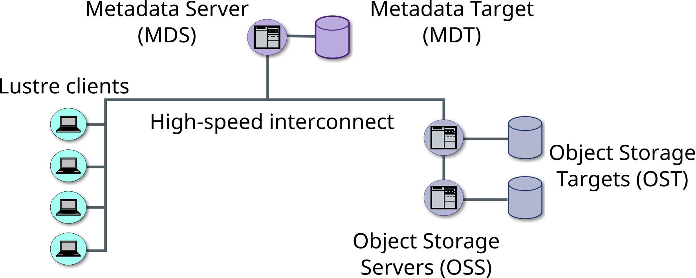
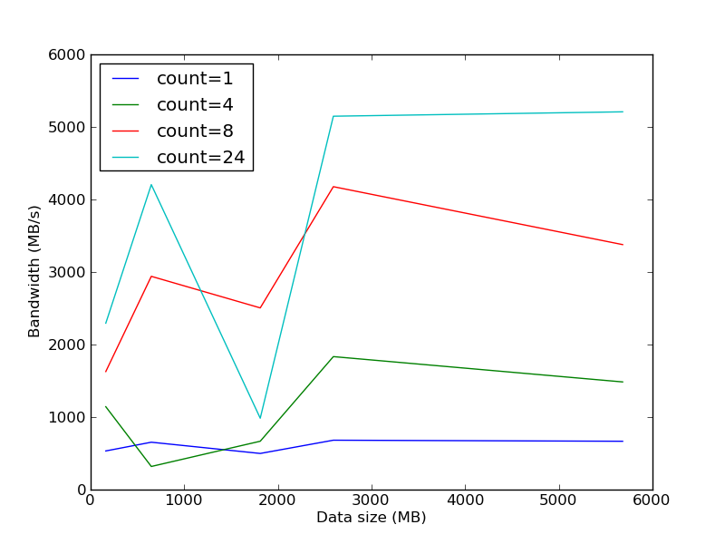

# I/O in HPC {.section}
# HPC

 {.center width=60%}

 - frequency growth stopped around 2005
 - modern (super)computers rely on parallel processing

# HPC and I/O data

 - Reading initial conditions or datasets for processing
 - Storing numerical output from simulations for later analysis
 - Checkpointing to files for restarting in case of system failure
 - 'out-of-core' techniques when the  data is larger than one can fit in system memory

# Parallel I/O
- Mapping problem: how to convert internal structures and domains to
files which are streams of bytes
- Transport problem: how to get the data efficiently from hundreds to
thousands of nodes on the supercomputer to physical disks

{.center}

- ***Users need to understand the I/O infrastructure!***

# Parallel I/O

- Good I/O is non-trivial
  - Performance, scalability, reliability
  - Ease of use of output (number of files, format)
  - Portability
- One cannot achieve all of the above - one needs to prioritize

# Parallel I/O

- Challenges
    - Number of tasks is rising rapidly
    - Size of the data is also rapidly increasing
    - Disparity of computing power vs. I/O performance is getting worse
    and worse
- The need for I/O tuning is algorithm & problem specific
- ***Without parallelization, I/O will become scalability bottleneck for
    practically every application!***

# I/O layers

# I/O library choice

- POSIX and MPI-I/O libraries
    - Provides methods for writing raw data into files
    - Do not provide a schema or methods for writing metadata
    - The user has to develop a file format specification, or implement a
      given format
- Additionally there are also higher level libraries that
    - Gives tools for writing data + metadata, e.g. HDF5
    - Or even provide a application or domain specific schema for what
      data + metadata to describe a particular kind of data

# Parallel File systems {.section}

# Anatomy of supercomputer
 {.center width=80%}

# File systems

- All large parallel computer systems provide a parallel file
  system area
    - Files can be accessed from all tasks
    - Large systems often have dedicated I/O nodes
- Some systems also provide a local disk area for temporary storage
    - Only visible to tasks on the same node
    - Results have to be copied after simulation

# Lustre

- Lustre is a popular parallel file system that is used in many large
  systems
    - Also at CSC (Puhti, Mahti, Lumi)
- Separated storage of data and metadata
    - Single metadata server
    - Clustered data storage
    - Supports e.g. striping of large datafiles for higher performance

# Lustre architecture

# Lustre file striping

# Lustre file striping

- Striping pattern of a file/directory can be queried or set with the
  `lfs` command
- `lfs getstripe` <*dir*|*file*>
- `lfs setstripe` -c *count* *dir*
    - Set the default stripe count for directory *dir* to *count*
    - All the new files within the directory will have the specified
    striping
    - Also stripe size can be specified, see *man lfs* for details
- Proper striping can enhance I/O performance a lot

# Performance with Lustre striping

{.center width=60%}

# Performance considerations

- Files are often assigned in a round robin fashion over multiple OSTs
- You can overwhelm an OST, OSS or MDS
- Per node limits on bandwidth
- Testing can be super noisy, performance depends on the load
- Very large cache effects
- More stripes does not automatically improve performance

# Parallel I/O with posix {.section}

# Parallel POSIX I/O

- Spokesman strategy
    - One process takes care of all I/O using normal (POSIX) routines
    - Requires a lot of communication
    - Writing/reading slow, single writer not able to fully utilize
      filesystem
    - Does not scale, single writer is a bottleneck
    - Can be good option when the amount of data is small (e.g. input
      files)

# Parallel POSIX I/O

- Every man for himself
    - Each process writes its local results to a separate file
    - Good bandwidth
    - Difficult to handle a huge number of files in later analysis
    - Can overwhelm the filesystem (for example Lustre metadata)

# Summary

- Parallel file system is needed for efficient parallel I/O
    - Striping of files
- Primitive parallel I/O can be achieved using just normal Posix calls (+
  MPI communication)
    - Spokesman strategy
    - Every man for himself
    - Subset of writers/readers
    - ***Standard Output and Error streams are effectively serial I/O!***
