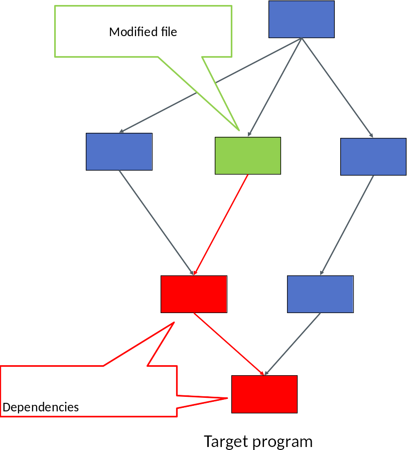

# Compiling and linking: a reminder

- A compiler turns a source code file into an object file of machine code that the processor can understand
- A linker combines several compiled object files into one executable file
- Together, compiling and linking can be called buildinga

# Make

<div class="column">
- Large programs are usually separated into several files and can have complicated dependency structures
- Compilation and linking becomes complicated and prone to errors
</div>
<div class="column">
{width=80%}
</div>
# Simple Makefile example

<div class="column">
- Comments start with #
- Syntax for targets is  
`target: dep1 dep2`
- Recipies are written after target and indented with tabulator!
- The first target in the file is the one that gets generated by default

</div>
<div class="column">

```make
# Compile hello
hello: hello.c
	gcc -o hello hello.c
```
\  
\  
\  
   
```bash
$ make hello
$ gcc -o hello hello.c
```
</div>


# Modules and batch job system {.section}

# Module environment on Sisu

- Supercomputers usually have a large number of users and different users need different development environments and applications
- _Environment modules_ provide a convenient way to dynamically change the user's
environment so that different compiler suites and application versions can be used more easily

# Most common Module commands in Sisu
<div class="column">
`module load mod`  
`module unload mod`  
`module show mod`  
`module avail`  
`module list`  
`module switch mod1 mod2`  
`module help mod`  
</div>

<div class="column">
<small>
Load module **mod** in shell environment  
Remove module **mod** from environment  
Get information about module **mod**  
List all available modules  
List loaded modules  
Switch loaded **mod1** to **mod2**    
Get information about a module or, if no argument is given, about the module sub-commands  
</small>
</div>

# Batch queue system

- Manages the workflow for supercomputers
	- High overall resource utilization
	- CSC systems use SLURM
- To run your program on a supercomputer you need to
	- Describe how you want to run the job (in a batch job file)
	- Add a command that launches your program: 
		- Sisu uses **aprun** (we put this in the batch job file)
		- Taito uses **srun** as job launcher
	- Submit your job to a queue

# Batch job file on Sisu

```bash
#!/bin/bash                      | Invokes bash shell
#SBATCH -J my_job_name           | Defines a name for your job
#SBATCH –o %J.out                | Standard output file
#SBATCH –e %J.err                | Standard error file
#SBATCH –N 1                     | Number of nodes to use (each has 24 cores)
#SBATCH –t 1:00:00               | Maximum time to run the program (hh:mm:ss)
#SBATCH –p test                  | Batch job partition (initially use ’test’)
aprun –n 24 path_to_program
```

# Running batch jobs
- Submit your batch job script to the queue using sbatch  
		`$ sbatch my_job.sh`
- You can follow the status of your jobs with squeue:  
		`$ squeue -u my_username`
- If something goes wrong, you can cancel your job with scancel:  
		`$ scancel jobid`  
		(here the jobid is the numeric id of the job)
